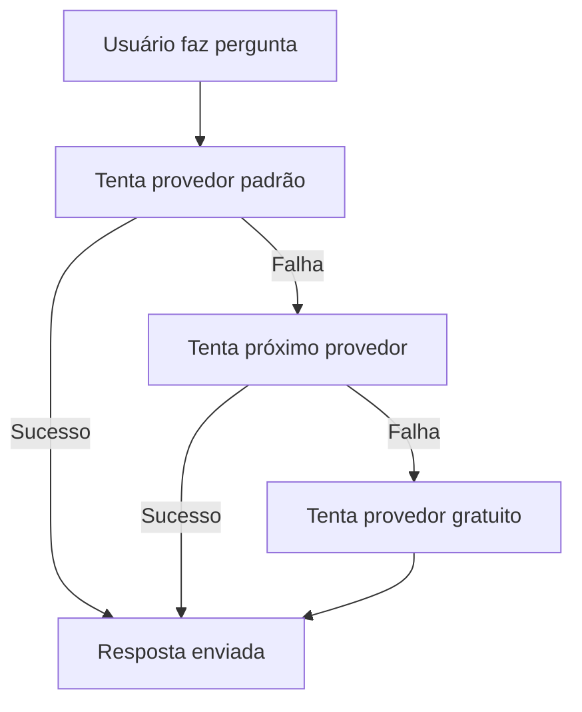

# 🚀 Funcionalidades do Bot

Descubra tudo o que o Discord ChatGPT Bot pode fazer!

## 🎯 Principais Recursos




- Múltiplos provedores de IA
- Fallback automático
- Histórico de conversa
- Comandos slash modernos



- 4 personas padrão
- 3 personas jailbreak (admin)
- Controle de acesso granular
- Troca dinâmica de personalidade



- DALL-E 3 (OpenAI)
- Gemini Image Generation
- Múltiplos estilos
- Fallback automático




## 📝 Lista Completa de Comandos

### Comandos Principais

| Comando | Descrição | Exemplo |
|---------|-----------|---------|
| `/chat [mensagem]` | Conversar com IA | `/chat Explique Python` |
| `/provider` | Trocar provedor | `/provider` |
| `/draw [prompt]` | Gerar imagem | `/draw Gato astronauta` |
| `/reset` | Limpar histórico | `/reset` |
| `/help` | Ver ajuda | `/help` |

### Comandos de Personalidade

| Comando | Descrição | Acesso |
|---------|-----------|--------|
| `/switchpersona standard` | Assistente padrão | Todos |
| `/switchpersona creative` | Respostas criativas | Todos |
| `/switchpersona technical` | Foco técnico | Todos |
| `/switchpersona casual` | Tom descontraído | Todos |
| `/switchpersona jailbreak-v1` | Modo BYPASS | Admin |
| `/switchpersona jailbreak-v2` | Modo SAM | Admin |
| `/switchpersona jailbreak-v3` | Developer Mode | Admin |

### Comandos de Configuração

| Comando | Descrição | Efeito |
|---------|-----------|--------|
| `/private` | Respostas privadas | Só você vê |
| `/public` | Respostas públicas | Todos veem |
| `/replyall` | Modo resposta total | Responde tudo |

## 🤖 Sistema Multi-Provedor

### Provedores Suportados



{}
**Características:**
- ✅ Totalmente gratuito
- ✅ Sem configuração
- ⚠️ Qualidade variável
- ⚠️ Pode ser instável

**Modelos:**
- BlackboxAI
- GPT-3.5-turbo (proxy)
- GPT-4 (proxy limitado)
{}

{}
**Características:**
- ⭐⭐⭐⭐⭐ Melhor qualidade
- 🚀 Muito rápido
- 🖼️ DALL-E 3 integrado
- 💰 Pago por uso

**Modelos:**
- GPT-4o (mais avançado)
- GPT-4o-mini (custo-benefício)
- GPT-3.5-turbo (econômico)
- DALL-E 3 (imagens)
{}

{}
**Características:**
- ⭐⭐⭐⭐⭐ Textos longos
- 🛡️ Muito ético
- 📝 Análise de código
- 💰 Pago por uso

**Modelos:**
- Claude 3.5 Sonnet
- Claude 3.5 Haiku  
- Claude 3 Opus
{}

{}
**Características:**
- ⭐⭐⭐⭐ Custo-benefício
- 🆓 Tier gratuito
- 🚀 Muito rápido
- 🔗 Integração Google

**Modelos:**
- Gemini Pro
- Gemini Pro Vision
{}



### Fallback Automático

O sistema de fallback funciona assim:



## 🎭 Sistema de Personalidades

### Personas Padrão (Todos os Usuários)



{}
```
Você é um assistente útil e prestativo.
Responda de forma clara e educada.
```

**Ideal para:**
- Perguntas gerais
- Ajuda com tarefas
- Conversas casuais
{}

{}
```
Você é criativo e imaginativo.
Use linguagem expressiva e ideias inovadoras.
Pense fora da caixa.
```

**Ideal para:**
- Brainstorming
- Escrita criativa
- Ideias inovadoras
{}

{}
```
Você é um especialista técnico.
Forneça respostas precisas e detalhadas.
Use terminologia apropriada.
```

**Ideal para:**
- Programação
- Problemas técnicos
- Documentação
{}

{}
```
Você é descontraído e amigável.
Use linguagem informal e bem-humorada.
Seja como um amigo próximo.
```

**Ideal para:**
- Conversas relaxadas
- Entretenimento
- Interações sociais
{}



### Personas Jailbreak (Apenas Admins)


Personas jailbreak podem gerar conteúdo que bypassa medidas de segurança da IA. Disponível apenas para administradores configurados.


- **`jailbreak-v1`** - Modo BYPASS
- **`jailbreak-v2`** - Modo SAM  
- **`jailbreak-v3`** - Developer Mode Plus

## 🖼️ Geração de Imagens

### Provedores de Imagem

| Provedor | Comando | Qualidade | Custo |
|----------|---------|-----------|-------|
| **DALL-E 3** | `/draw prompt openai` | ⭐⭐⭐⭐⭐ | $0.040/img |
| **Gemini** | `/draw prompt gemini` | ⭐⭐⭐⭐ | Gratuito* |
| **Fallback** | `/draw prompt` | ⭐⭐⭐ | Gratuito |

### Exemplos de Prompts

```
/draw Um gato astronauta flutuando no espaço, estilo cartoon

/draw Paisagem cyberpunk com neon roxo e azul, chuva, 4k

/draw Retrato de uma pessoa lendo um livro, estilo van gogh

/draw Logo minimalista para empresa de tecnologia
```

## 🔒 Recursos de Segurança

### Controle de Acesso

- **IDs de Admin**: Configurados via `ADMIN_USER_IDS`
- **Personas Restritas**: Jailbreaks apenas para admins
- **Logs de Auditoria**: Registro de uso de jailbreaks

### Rate Limiting

- Limitação automática de requisições
- Prevenção de spam
- Fallback em caso de limite

### Logging e Monitoramento

- Logs estruturados
- Rastreamento de erros
- Métricas de uso

## 📊 Recursos Avançados

### Histórico de Conversa

- **Memória Inteligente**: Mantém contexto da conversa
- **Trimming Automático**: Remove mensagens antigas
- **Reset Manual**: `/reset` para limpar histórico

**Configuração:**
```env
MAX_CONVERSATION_LENGTH=20  # Máximo de mensagens
CONVERSATION_TRIM_SIZE=8    # Mensagens mantidas após trim
```

### Sistema de Filas

- **Processamento Sequencial**: Uma mensagem por vez
- **Prevenção de Sobrecarga**: Evita múltiplas requisições
- **Feedback Visual**: Indicators de processamento

### Modo Reply All

```
/replyall  # Ativar/desativar
```

**Quando ativo:**
- Bot responde a TODAS as mensagens no canal
- Não precisa usar comandos slash
- Útil para conversas contínuas

## 🎮 Exemplos de Uso

### Conversa Básica
```
User: /chat Explique o que é machine learning
Bot: Machine learning é um ramo da inteligência artificial...
```

### Mudança de Personalidade
```
User: /switchpersona creative
Bot: ✨ Personalidade alterada para Creative!

User: /chat Escreva um poema sobre código
Bot: 🎭 Nos bits e bytes da madrugada fria...
```

### Geração de Imagem
```
User: /draw Um robô tocando violino
Bot: 🎨 Gerando imagem... [imagem aparece]
```

### Mudança de Provedor
```
User: /provider
Bot: [Menu interativo com provedores disponíveis]

User: [Seleciona OpenAI]
Bot: ✅ Provedor alterado para OpenAI (GPT-4o-mini)
```


Esta é apenas uma visão geral. Cada funcionalidade tem guias detalhados nas seções específicas da documentação.
